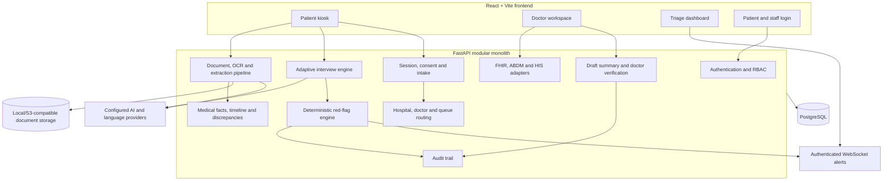
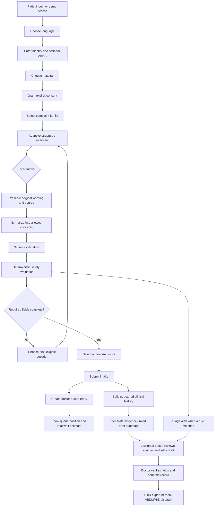
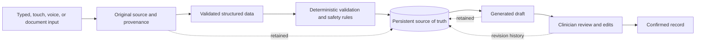
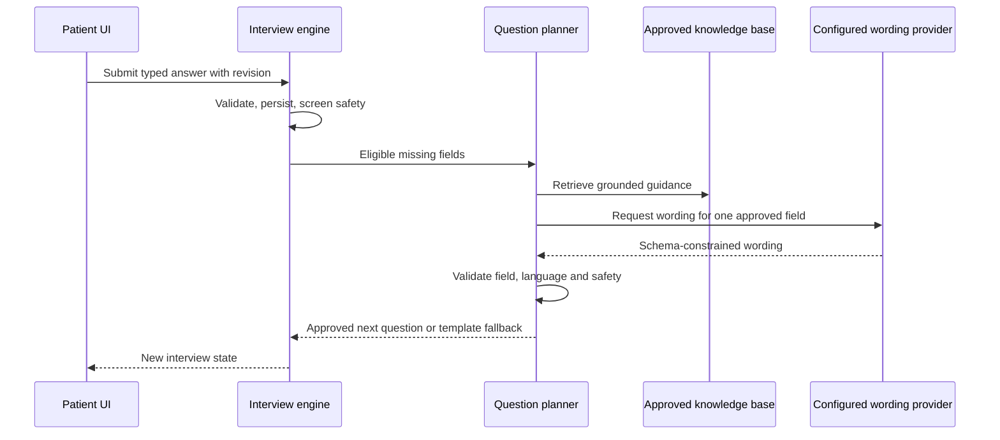
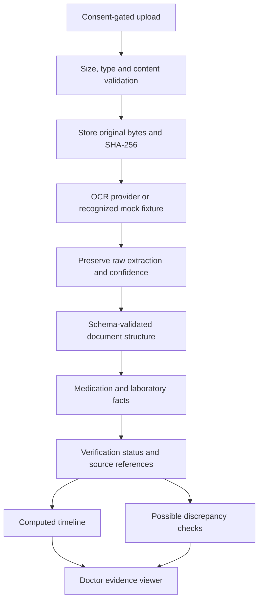
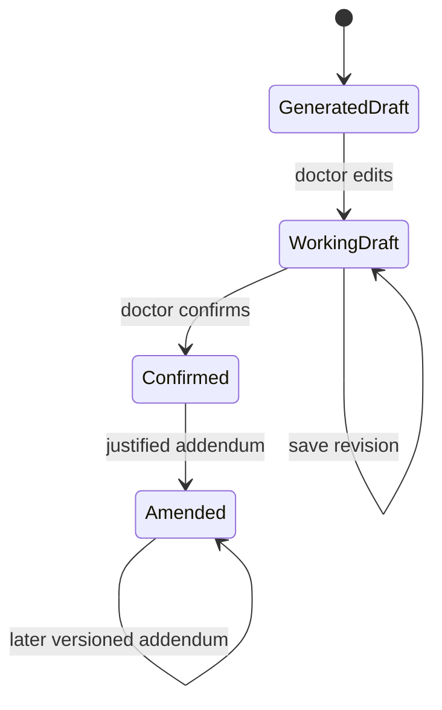
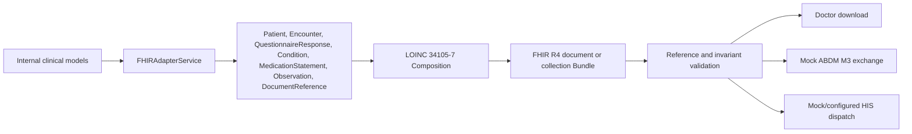

# MediKiosk: Complete Project Roadmap and Implementation Guide

**Project:** MediKiosk  
**Current scope:** Phase 12 local synthetic-data prototype  
**Architecture:** Modular monolith  
**Primary purpose:** Collect and structure patient history before consultation so clinicians receive a reviewable draft rather than an unstructured queue-side conversation.

## 1. Executive summary

MediKiosk is an AI-assisted pre-consultation clinical intake prototype. A patient signs in, chooses a hospital and doctor, grants consent, answers an adaptive multilingual questionnaire, optionally uses speech and uploads previous documents, and submits the intake. The system continuously applies deterministic safety rules, creates a queue entry and wait estimate, structures the collected evidence, and prepares a draft summary. Triage staff can see explainable safety alerts, while the assigned doctor reviews source evidence, edits the draft, verifies individual facts, and explicitly confirms the clinical record.

MediKiosk does **not** diagnose, prescribe, or replace clinical review. Patient statements, machine-normalized concepts, document extractions, alerts, and generated summaries retain their source and verification state. Only a clinician-confirmed result is treated as a confirmed record inside the prototype.

## 2. Product goals

- Reduce consultation time spent collecting routine history.
- Support English, Bengali, and Hindi patient interaction.
- Provide touch and optional voice input.
- Ask complaint-specific questions without losing required history coverage.
- detect potential emergency symptoms through deterministic, explainable rules.
- Preserve uploaded documents and extraction provenance.
- Present a longitudinal timeline and possible evidence discrepancies.
- Give doctors an editable, evidence-linked draft summary.
- Preserve audit history and clinician control.
- Export a validated FHIR R4 representation and demonstrate ABDM/HIS interoperability.

## 3. Clinical and safety boundary

The application is an intake and documentation aid, not an autonomous clinical system.

Allowed behavior:

- “Patient reported…”
- “Previous document indicates…”
- “Potential emergency symptoms detected.”
- “Immediate clinical assessment recommended.”
- “Needs verification.”

Disallowed behavior:

- declaring a diagnosis as fact;
- recommending or changing treatment;
- telling a patient to start or stop medicine;
- treating OCR or AI output as verified evidence;
- bypassing doctor review;
- using an LLM as the only authority for safety, consent, authorization, completeness, or audit events.

All clinical rules, translations, extraction fixtures, and synthetic demonstrations require appropriate clinical validation before real-world deployment.

## 4. System architecture



The frontend and backend are deployed as one application boundary for the MVP. Backend “services” are internal code modules, not independently deployed microservices.

## 5. End-to-end patient and clinical workflow



### Patient portal

1. The patient authenticates using the supported local/demo authentication flow.
2. The patient chooses English, Bengali, or Hindi.
3. The patient supplies identity details and can enter an ABHA number or handle for the sandbox demonstration.
4. The patient chooses a hospital and grants separate consent for clinical sharing, voice processing, and document processing.
5. The interview collects the chief complaint and routes into one of the supported complaint flows.
6. The patient answers using touch controls, typed text, or consent-gated speech.
7. Previous prescriptions or reports can be uploaded when document consent is enabled.
8. After completion, the system assigns the visit to the selected doctor, stores a queue entry, and shows queue position, doctor, estimated total wait time, and expected meeting time. Loading, failure, and retry states are visible.

### Triage portal

1. Structured answers are evaluated continuously against versioned deterministic rules.
2. A matching rule creates or updates an alert containing priority, rule identifier, human-readable reason, triggering structured facts, timestamp, revision, and acknowledgement state.
3. Authenticated triage staff receive live events through a ticketed WebSocket and reload authoritative state after reconnects.
4. Staff can acknowledge alerts; removed triggers resolve without deleting audit history.
5. Alert reasons describe observed facts and recommended assessment priority, never an inferred diagnosis.

### Doctor portal

1. Only the assigned doctor with an active hospital membership can list or open the visit.
2. The queue supports `WAITING`, `CALLED`, `IN_CONSULTATION`, `COMPLETED`, and `CANCELLED` transitions.
3. The doctor sees patient-reported answers, normalization state, uploaded source documents, structured facts, alerts, timeline entries, and possible discrepancies.
4. The machine draft remains separate from the editable working copy.
5. Field verification and summary changes create append-only revision records.
6. Confirmation stores verifier identity and time and locks the confirmed version.
7. Later changes require an explicit amendment rather than silently replacing the confirmed record.

## 6. Canonical data pipeline



The structured database record is authoritative. Raw transcripts and source files are preserved for traceability, but neither raw conversation text nor generated prose becomes canonical by itself.

## 7. Adaptive interview implementation

Supported standard complaint families:

1. Chest pain
2. Abdominal pain
3. Fever
4. Headache
5. Cough or breathlessness

A separate AYUSH demonstration flow records patient-reported Dashavidha-style categories without calculating a constitution, diagnosing a condition, or recommending treatment.

Question definitions live in `ai/complaint_flows/`. Each flow supplies typed questions, localized wording, required fields, branching conditions, and completion rules. The deterministic engine remains responsible for eligibility and required-field completion. Grounded RAG may choose and word an approved missing question, but it cannot invent a new clinical field or override safety logic.

Every answer stores:

- session and question identifiers;
- canonical field;
- typed value and original wording;
- language and input source;
- verification status;
- normalization result and provider provenance when applicable;
- revision/cursor information used to reject stale submissions.

## 8. AI, RAG, language, and speech

### Permitted AI roles

- normalize patient language into the approved ontology;
- retrieve grounded clinical interviewing guidance;
- word an already-approved next question;
- transcribe or synthesize speech through configured adapters;
- extract fields from a supported document schema;
- assist summary generation from validated structured data.

### Provider abstraction

The backend isolates external systems behind service interfaces. Configuration can select deterministic mocks or supported provider adapters without changing frontend contracts. The repository contains adapters for NVIDIA-backed normalization/embeddings and RAG wording, Sarvam speech/translation/OCR paths, and BHASHINI speech. Live-provider reliability and clinical acceptance are not implied by adapter availability.

### RAG flow



If retrieval, generation, translation, speech, or normalization fails, intake continues through explicit fallback behavior. Patient source answers remain stored.

## 9. Deterministic red-flag screening

Rules are versioned JSON configuration under `ai/safety_rules/`. The engine evaluates present, certain, structured facts and preserves the original triggering field and text. It does not rely on substring-only matching or on an LLM decision.

Alert lifecycle:

```text
new trigger -> active alert -> staff acknowledgement
trigger removed -> resolved alert with history preserved
trigger returns -> reactivated alert with a new revision
```

All safety rules remain prototype/demo logic until qualified clinical review.

## 10. Document and evidence pipeline



Arbitrary files do not receive fabricated mock extraction. Recognized synthetic fixtures are explicitly labelled. Missing flags, units, dates, and confidence remain unknown. Corrected values do not overwrite the original extraction.

## 11. Summary, verification, and audit model

The draft summary is built from validated patient answers, normalized facts, document-derived medication/lab facts, computed timeline entries, discrepancies, and red-flag alerts. It contains ten fixed structured sections and explicitly preserves unknown or unreported information.

Summary states:



The system retains the original generated draft, each clinician revision, verifier identity, verification timestamp, confirmed text, amendments, and related audit events.

## 12. FHIR, ABDM, and HIS interoperability

FHIR is an adapter over the internal relational model. It does not dictate database storage.



- FHIR `Condition` resources describe provisional patient-reported complaints, not diagnoses.
- Document bundles place `Composition` first and validate internal `urn:uuid:` references.
- ABDM M1 demonstrates ABHA verification, M2 demonstrates care-context linking, and M3 packages the FHIR exchange.
- The local HIS adapter produces a synthetic acknowledgement receipt unless a configured integration is explicitly enabled.
- Export, linking, and dispatch actions are audited and require doctor authorization.

## 13. Technology stack

| Layer | Technology | Responsibility |
|---|---|---|
| Frontend | React 19, TypeScript 6, Vite 8 | Patient, doctor, triage, and authentication interfaces |
| Styling | Tailwind CSS 4 plus shared CSS | Responsive layout, design tokens, states, and accessibility |
| Routing | React Router 7 | Role-aware client routes |
| Frontend tests | Vitest, React Testing Library, Playwright | Components, workflows, and browser journeys |
| Backend | Python, FastAPI 0.141 | REST API, WebSocket admission, validation, orchestration |
| Schemas | Pydantic 2 | Typed request/response and AI-output validation |
| Persistence | SQLAlchemy ORM | Relational models and transactions |
| Migrations | Alembic | Versioned database evolution |
| Database | PostgreSQL; isolated SQLite for selected tests | Structured clinical, workflow, and audit data |
| HTTP/providers | HTTPX and provider SDK adapters | External AI, language, and integration calls |
| Backend tests | pytest | Service, API, authorization, migration, and safety tests |
| Quality | Ruff, ESLint, Prettier | Linting and formatting |
| Interoperability | HL7 FHIR R4-shaped Pydantic models | Export and exchange boundary |

## 14. Repository structure

```text
MediKiosk/
├── frontend/                 React/Vite application
│   ├── src/routes/           kiosk, doctor, triage and login pages
│   ├── src/components/       reusable clinical and UI components
│   ├── src/api/              typed API client
│   ├── src/i18n/             English, Bengali and Hindi copy
│   ├── src/test/             component and workflow tests
│   └── e2e/                  Playwright journeys
├── backend/
│   ├── app/api/v1/           REST and WebSocket route modules
│   ├── app/models/           SQLAlchemy persistence models
│   ├── app/schemas/          Pydantic API/FHIR schemas
│   ├── app/services/         domain and provider services
│   ├── alembic/              migrations
│   └── tests/                backend test suites
├── ai/
│   ├── complaint_flows/      adaptive interview configuration
│   ├── safety_rules/         deterministic red-flag rules
│   ├── ontology/             allowed normalized concepts
│   ├── knowledge_base/       grounded RAG content
│   ├── prompts/              versioned provider prompts
│   └── document_fixtures/    explicit synthetic extraction fixtures
├── docs/                     product, architecture and status documentation
├── scripts/                  setup, start, stop and verification tools
└── .runtime/                 ignored local runtime data
```

## 15. Main API areas

All application endpoints are under `/api`.

| Prefix | Main responsibility |
|---|---|
| `/auth` | Patient OTP/demo access, staff login, logout, current user |
| `/hospitals` | Hospital directory and doctor roster |
| `/sessions` | Intake sessions, hospital/doctor selection, consent, answers, completion, queue estimate |
| `/sessions/{id}/documents` | Upload, list, inspect, verify and retrieve documents |
| `/sessions/{id}/speech` | Consent-gated transcription and question playback |
| `/doctor` | Assigned queue, session detail, summary review, verification, exports, demo tools |
| `/doctor/sessions` | Medical facts, timeline, discrepancies and review operations |
| `/triage` | Alert queue, acknowledgement, staff WebSocket ticket and live events |
| `/rag` | Authenticated retrieval and grounded demonstration endpoints |

The OpenAPI explorer is available at `/docs` while the backend is running.

## 16. Authentication, authorization, and privacy

- Patient and staff roles are separated.
- Protected frontend routes mirror backend role checks but never replace them.
- Owned patient sessions require the matching authenticated patient.
- Doctor access requires assignment to the visit and active membership in its hospital.
- Triage staff cannot directly read patient intake sessions through patient endpoints.
- WebSocket access uses short-lived, single-use staff tickets and permitted origins.
- Consent is checked server-side before voice/document processing.
- Server code owns reviewer and acknowledgement identity.
- Raw documents, audit logs, verification revisions, and confirmed records are not silently overwritten.
- Local demo credentials, runtime databases, logs, uploads, and provider secrets stay in ignored files.

The current authentication and local storage configuration are prototype-grade. Production deployment requires hardened identity, secret management, encryption, retention, monitoring, backup, and operational controls.

## 17. Roadmap and implementation status

| Phase | Scope | Current status |
|---|---|---|
| 0 | Repository, documentation, environment conventions | Complete |
| 1 | End-to-end session, consent, intake, doctor review foundation | Complete |
| 2 | Five adaptive complaint flows plus separate AYUSH demonstration | Complete |
| 3A | Provider-neutral clinical normalization with provenance | Complete for deterministic prototype |
| 3B | NVIDIA normalization adapter | Implemented; reliable live acceptance remains open |
| 4A | Voice input and question playback abstraction | Implemented with mocks and adapter coverage |
| 4B | BHASHINI adapter | Implemented; live acceptance remains open |
| 5 | Deterministic red flags and triage dashboard | Implemented for prototype rules |
| 6 | Document storage, validation and typed extraction | Implemented with explicit fixtures; real OCR not accepted |
| 7 | Medication/lab facts, timeline, discrepancies, verification | Complete for synthetic scope |
| 8 | Evidence-linked draft clinical summary | Complete for deterministic prototype |
| 9 | Field verification, amendments, audit trail, cross-references | Complete |
| 10 | FHIR R4 export and validation | Complete for prototype scope |
| 11 | ABDM M1/M2/M3 and HIS demonstration | Complete as sandbox/mock workflow |
| 12 | Showcase seeding, fullscreen kiosk, polished triage/doctor demo | Complete |
| Next | Clinical validation, reliable live providers, production security and operations | Not complete |

## 18. Remaining work toward production

1. Obtain clinician review and approval for questions, safety rules, summaries, and workflows.
2. Professionally validate Bengali/Hindi wording and accessibility with representative users.
3. Replace synthetic OCR acceptance with a production-grade, evaluated OCR/document pipeline.
4. Complete reproducible live acceptance for configured normalization, RAG, speech, and translation providers.
5. Introduce production identity, authorization administration, secret rotation, encryption, retention, and incident controls.
6. Add durable event delivery and escalation for safety alerts.
7. Complete full PostgreSQL restart/recovery acceptance on the target Windows environment.
8. Validate FHIR profiles and ABDM/HIS exchange against the actual receiving systems.
9. Add observability, backups, disaster recovery, load testing, and deployment runbooks.
10. Conduct security, privacy, accessibility, clinical-safety, and regulatory reviews before real patient use.

## 19. Running the project

From PowerShell in the repository root:

```powershell
powershell -NoProfile -ExecutionPolicy Bypass -File scripts/start-dev.ps1
```

Default configured local addresses:

- Application: `http://127.0.0.1:5175`
- Doctor workspace: `http://127.0.0.1:5175/doctor`
- Triage dashboard: `http://127.0.0.1:5175/triage`
- API documentation: `http://127.0.0.1:8010/docs`
- PostgreSQL: `127.0.0.1:55432`

Stop application processes while preserving data:

```powershell
powershell -NoProfile -ExecutionPolicy Bypass -File scripts/stop-dev.ps1
```

Environment templates are in `.env.example`, `backend/.env.example`, and `frontend/.env.example`. Use fictional patient information in the prototype.

## 20. Verification workflow

Backend:

```powershell
cd backend
.\venv\Scripts\python.exe -m pytest -q
.\venv\Scripts\ruff.exe check app tests
```

Frontend:

```powershell
cd frontend
npm test
npm run lint
npm run format:check
npm run build
npm run test:e2e
```

Migration, restart, security, and provider-specific verification scripts live in `scripts/` and `backend/app/scripts/`. A passing automated suite demonstrates software behavior under its tested configuration; it does not establish clinical safety or production readiness.

## 21. How to extend MediKiosk safely

When adding a complaint flow or clinical field:

1. Define the typed field and localized question in the versioned flow configuration.
2. Preserve original patient wording and explicit unknown states.
3. Add deterministic eligibility, branching, and completion tests.
4. Add ontology entries only through a reviewed schema change.
5. Keep safety rules separate, deterministic, explainable, and versioned.
6. Update persistence and API schemas together.
7. Ensure summaries cite the new source evidence.
8. Keep doctor verification and revision history intact.
9. Update FHIR mapping only when a valid resource/profile mapping exists.
10. Update documentation and run relevant backend, frontend, and browser tests.

## 22. Source-of-truth documentation

This guide provides a unified overview. Detailed contracts and decisions remain in:

- [Roadmap](roadmap.md)
- [Architecture](architecture.md)
- [API contract](api-contract.md)
- [Data model](data-model.md)
- [Clinical scope](clinical-scope.md)
- [Implementation status](implementation-status.md)
- [Stabilization status](stabilization-implementation-status.md)
- [Decision log](decisions.md)
- [Security and privacy](security-privacy.md)
- [Testing guide](testing.md)
- [Setup guide](setup.md)

If this overview conflicts with an accepted architecture decision record or a typed API/schema implementation, the decision record and current typed contract take precedence and this guide should be updated.
